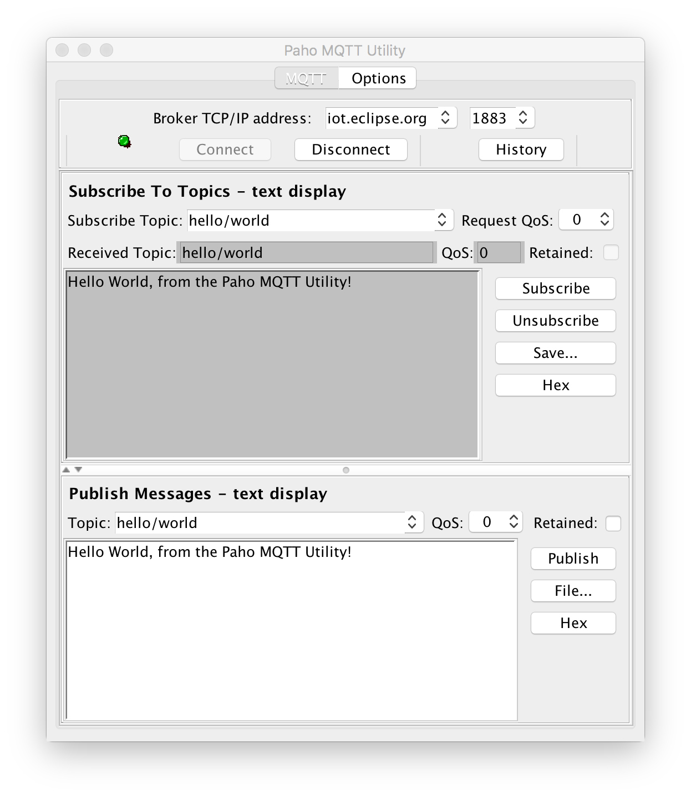

# Eclipse Paho MQTT Utility

The Paho MQTT Utility is a lightweight but effective utility allowing you to test communication with an MQTT Broker as well as publish and subscribing to topics for application testing.

## How to Download and Use:
You can either build the Jar locally by calling `mvn package -DskipTests` from the parent directory, or you can download it from the Eclipse Repositories:
 - [Release Repository](https://repo.eclipse.org/content/repositories/paho-releases/br/com/anteros/br.com.anteros.mqtt.utility/)
 - [Snapshot Repository](https://repo.eclipse.org/content/repositories/paho-snapshots/br/com/anteros/br.com.anteros.mqtt.utility/)

Once you have the Jar, run it by executing: `java -jar br.com.anteros.mqtt.utility-1.1.1.jar` substituting the correct filename depending on the version.